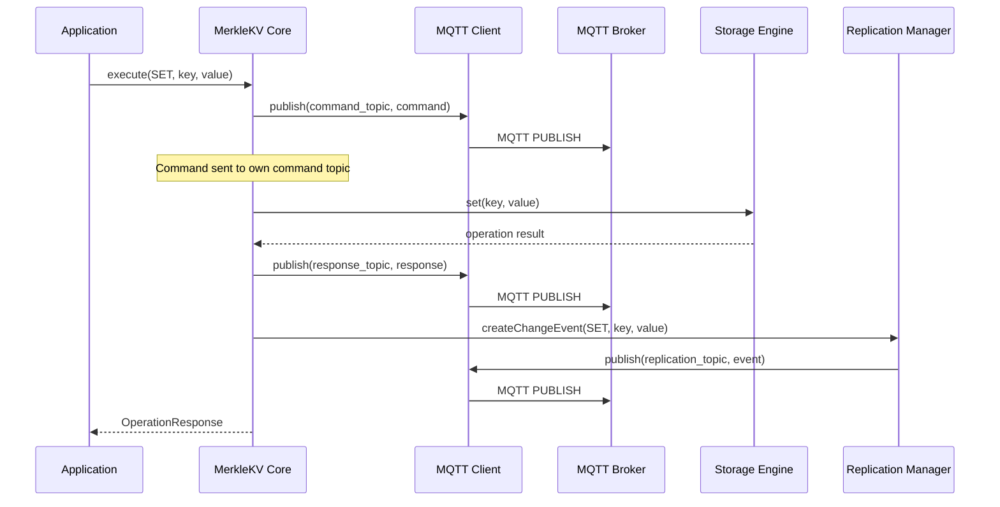
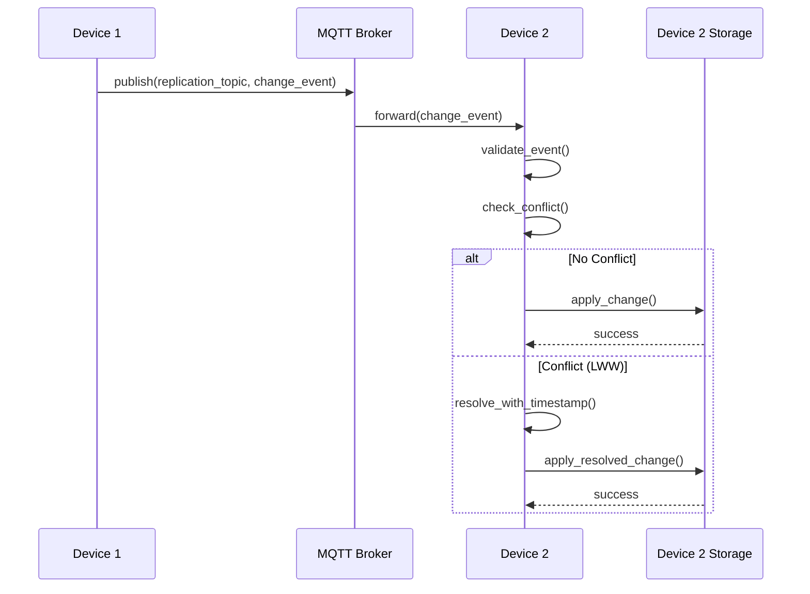
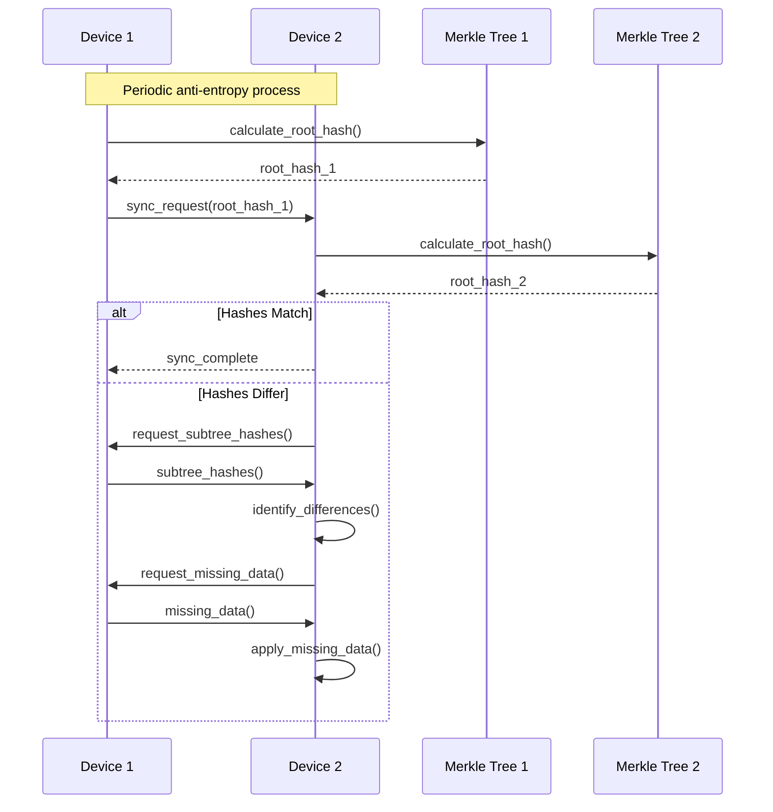

# MerkleKV Mobile Architecture

This document provides a comprehensive overview of the MerkleKV Mobile system architecture, including
component interactions, data flow, and design decisions.

## 🏗️ System Overview

MerkleKV Mobile is a distributed key-value store designed specifically for mobile and edge
environments. The system consists of several key components working together to provide reliable,
efficient data storage and synchronization across multiple devices.

### Core Principles

1. **Mobile-First Design**: Optimized for battery life, bandwidth usage, and intermittent connectivity
2. **MQTT-Based Communication**: Uses MQTT instead of direct TCP connections for better mobile compatibility
3. **Eventual Consistency**: Employs Last-Write-Wins conflict resolution with Merkle tree anti-entropy
4. **Platform Agnostic**: Core logic in Dart with platform-specific bindings

## 📊 Architecture Diagram

```text
┌─────────────────┐    ┌─────────────────┐    ┌─────────────────┐
│   Flutter App   │    │ React Native    │    │   CLI Tool      │
│                 │    │      App        │    │                 │
└─────────┬───────┘    └─────────┬───────┘    └─────────┬───────┘
          │                      │                      │
          │                      │                      │
┌─────────▼──────────────────────▼──────────────────────▼───────┐
│                 Platform Bindings                             │
│  ┌─────────────┐  ┌─────────────┐  ┌─────────────────────────┐│
│  │  Flutter    │  │ React Native│  │      CLI/Server         ││
│  │  Bindings   │  │  Bindings   │  │      Bindings           ││
│  └─────────────┘  └─────────────┘  └─────────────────────────┘│
└─────────────────────────┬─────────────────────────────────────┘
                          │
┌─────────────────────────▼─────────────────────────────────────┐
│                    MerkleKV Core                              │
│                                                               │
│  ┌───────────────┐  ┌──────────────┐  ┌─────────────────────┐ │
│  │ Command       │  │ Replication  │  │ Storage Engine      │ │
│  │ Processor     │  │ Manager      │  │                     │ │
│  └───────────────┘  └──────────────┘  └─────────────────────┘ │
│                                                               │
│  ┌───────────────┐  ┌──────────────┐  ┌─────────────────────┐ │
│  │ MQTT Client   │  │ Merkle Tree  │  │ Configuration       │ │
│  │               │  │              │  │ Manager             │ │
│  └───────────────┘  └──────────────┘  └─────────────────────┘ │
└─────────────────────────┬─────────────────────────────────────┘
                          │
┌─────────────────────────▼─────────────────────────────────────┐
│                    MQTT Broker                               │
│                                                               │
│  ┌───────────────┐  ┌──────────────┐  ┌─────────────────────┐ │
│  │ Authentication│  │ Topic        │  │ Message Routing     │ │
│  │ & ACL         │  │ Management   │  │                     │ │
│  └───────────────┘  └──────────────┘  └─────────────────────┘ │
└───────────────────────────────────────────────────────────────┘
```

## 🔄 Component Interactions

### 1. Command Processing Flow



### 2. Replication Flow



### 3. Anti-Entropy Synchronization



## 🏛️ Core Components

### MerkleKV Core

The central component containing all platform-agnostic logic:

- **Command Processor**: Handles incoming operations (GET, SET, DELETE, etc.)
- **Storage Engine**: Manages in-memory and persistent key-value storage
- **MQTT Client**: Manages broker connections and message handling
- **Replication Manager**: Coordinates data synchronization between devices
- **Merkle Tree**: Efficient data structure for anti-entropy synchronization
- **Configuration Manager**: Handles system configuration and validation

### Platform Bindings

Platform-specific adapters that expose the core functionality:

- **Flutter Bindings**: Dart package with Flutter-specific features
- **React Native Bindings**: Native bridge with TypeScript interface
- **CLI Bindings**: Command-line interface for administration

### MQTT Broker

Production-ready message broker with security features:

- **Authentication**: Username/password and certificate-based auth
- **Authorization**: Topic-level access control with ACL
- **TLS Encryption**: Secure communication between clients and broker
- **Persistence**: Message persistence and replay capabilities

## 📡 Communication Patterns

### Topic Structure

```text
merkle_kv_mobile/
├── {client_id}/
│   ├── cmd                    # Client command topic
│   └── res                    # Client response topic
├── replication/
│   └── events                 # Shared replication events
└── antientropy/
    ├── {client_id}           # Client-specific anti-entropy
    └── global                # Global anti-entropy coordination
```

### Message Formats

#### Command Message

```json
{
  "id": "req-uuid-1234",
  "op": "SET",
  "key": "user:123",
  "value": "john_doe",
  "timestamp": 1637142400000
}
```

#### Response Message

```json
{
  "id": "req-uuid-1234",
  "status": "OK",
  "value": "john_doe",
  "timestamp": 1637142401000
}
```

#### Replication Event

```cbor
{
  "op": "SET",
  "key": "user:123",
  "value": "john_doe",
  "timestamp": 1637142400000,
  "node_id": "device-xyz",
  "seq": 42,
  "checksum": "abc123"
}
```

## 🗄️ Storage Architecture

### Memory Storage

- **HashMap-based**: Fast in-memory key-value store
- **Thread-safe**: Concurrent access protection
- **TTL Support**: Optional time-to-live for keys
- **Size Limits**: Configurable memory usage limits

### Persistent Storage

- **File-based**: Platform-specific file storage
- **Journaling**: Write-ahead log for crash recovery
- **Compaction**: Periodic cleanup of old entries
- **Encryption**: Optional at-rest encryption

### Hybrid Approach

- **Write-through Cache**: Memory + persistence
- **Lazy Loading**: Load data on demand
- **Background Sync**: Asynchronous persistence

## 🔒 Security Model

### Authentication Layers

1. **MQTT Level**: Username/password or certificate-based
2. **Application Level**: API keys or tokens
3. **Data Level**: Optional value encryption

### Authorization Model

- **Topic-based ACL**: Control access to specific topics
- **Client ID patterns**: Restrict topic access by client ID
- **Role-based Access**: Different permissions for different user types

### Data Protection

- **TLS in Transit**: All MQTT communication encrypted
- **At-rest Encryption**: Optional local data encryption
- **Message Integrity**: Checksums for replication events

## 📈 Performance Characteristics

### Scalability

- **Horizontal**: Add more devices without central bottleneck
- **Vertical**: Efficient memory and CPU usage per device
- **Network**: Minimal bandwidth usage with compression

### Latency

- **Local Operations**: Sub-millisecond for memory operations
- **Remote Operations**: Network latency + broker processing
- **Replication**: Asynchronous, non-blocking

### Throughput

- **Read Operations**: Limited by storage backend
- **Write Operations**: Limited by replication overhead
- **Batch Operations**: Optimized for bulk operations

## 🔧 Configuration Management

### Environment-Specific Configs

- **Development**: Local broker, verbose logging
- **Testing**: In-memory storage, mock networking
- **Production**: TLS, persistent storage, minimal logging
- **Edge**: Resource-constrained optimizations

### Runtime Configuration

- **Dynamic Reconfiguration**: Update settings without restart
- **Configuration Validation**: Compile-time and runtime checks
- **Default Fallbacks**: Sensible defaults for all settings

## 🚀 Deployment Strategies

### Mobile Applications

- **App Store Distribution**: Standard mobile app deployment
- **Over-the-Air Updates**: Update logic without app store
- **Progressive Rollout**: Gradual feature deployment

### Edge Devices

- **Container Deployment**: Docker/Podman containers
- **Package Management**: OS-specific packages
- **Remote Management**: Configuration and update management

### Cloud Integration

- **Managed MQTT**: Cloud MQTT brokers (AWS IoT, Azure IoT)
- **Hybrid Cloud**: On-premises + cloud brokers
- **Edge Computing**: Edge-hosted broker instances

## 🔍 Monitoring and Observability

### Metrics Collection

- **Application Metrics**: Operation counts, latencies, errors
- **System Metrics**: Memory, CPU, network usage
- **Business Metrics**: Data growth, user engagement

### Logging Strategy

- **Structured Logging**: JSON-formatted log entries
- **Log Levels**: Configurable verbosity levels
- **Log Aggregation**: Centralized log collection

### Health Checks

- **Connectivity**: MQTT broker connection status
- **Storage**: Storage backend health
- **Replication**: Synchronization lag monitoring

This architecture provides a solid foundation for building scalable, reliable, and secure
distributed applications using MerkleKV Mobile.
